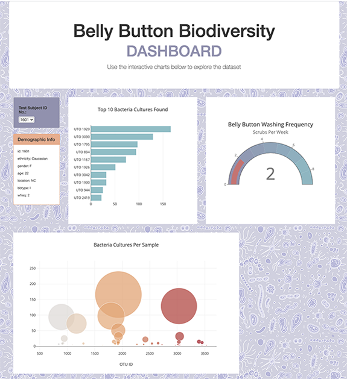

# plotly-bellybuttons
An Interactive Dashboard created with Plot.ly, D3, and JavaScript.

Used a JSON [dataset](http://robdunnlab.com/projects/belly-button-biodiversity/) that contains the fascinating results of which microbes were present in test subjects' belly buttons. 

View the [dashboard here](https://kristajoy.github.io/plotly-bellybuttons/).

### Drop Down Menu

The first step I took was to import the json file using d3 and create variables for the three main arrays of data contained inside. I used the first array of id numbers to populate the dropdown menu with the test subject id numbers that would act as our filter for which data each chart would display. (The html and initial set up with an empty bootstrap menu was provided.) I used d3 to select the empty menu and append new option tags for each id number in the array. 

### Bar Chart
I moved onto the bar chart which was the hardest chart to get formatted correctly for me. I ended up hard coding it first to get it looking right, and then worked backwards from there. The tricky part was realizing the OTU ids—used on the y axis—were integers so the chart's y axis was skewed and not showing just the 10 bars of data I needed but thousands. After some trial and error I found that I could map the "OTU " text to those integers which turned them into strings and cleared the problem.

### Bubble Chart
Next I worked on the bubble chart which was fairly straight forward following the plot.ly documentation.

### Demographic Information

Similar to working with the dropdown menu, I used d3 to select the div tag in the empty container and append new paragraph tags containing the key,value pairs. Two formatting problem I ran into was first, wanting the text to display with a colon instead of a comma—key: value vs key,value. I was able to format the text that d3 was appending to fix that. Second, was some longer text ran over the bounds of the container. A solution I discovered was using css to style the paragraph tag with an overflow-wrap and create a text break.

### Making them Interactive
I wrote a function that would load the intial charts onto the webpage using data for the first test subject's id (940) that was showing in the dropdown menu. I then wrote another function that would load when the change event was detected by d3 and someone selected a new value off the dropdown menu. The value of the option selected was filtered into the data which returned just the oject with the data needed to restyle the charts on the page with the new data matching the id.

One challenge here was realizing the test subjects' ids were integers in one block of data, and strings in another. So had to add parseInt where needed. 

### Gauge Chart
Taking what I earned from working on the previous charts I was able to create this third bonus chart using the data re: washing frequency in the deomgraphic information.

### Final Dashboard
Along the way I had fun making the dashboard more visually appealing, using css to format as well as within the javascript choosing complimentary colors. 

